# Sostenibility 🍃

Progetto realizzato nell'ambito del corso di Editoria Digitale del prof Ceravolo Paolo

Il WebBook è raggiungibile al seguente link: https://incrediblelego.github.io/SostenibilityHost/

Nella repository è inoltre presente l'applicazione Android che permette di aprire il WebBook direttamente da cellulare, in formato di pacchetto Android .apk

## Struttura

Il WebBook è stato realizzato utilizzando MkDocs. Utilizzando lo script python `DownloadWikibooks.py` opportunamente modificato inserendo il sito e il nome del file desiderati, è possibile scaricare da una fonte libera ovvero [WikiBooks](https://it.wikibooks.org/wiki/Pagina_principale) delle pagine riguardo a contenuti di sostenibilità ambientale. Le pagine estratte con lo script vengono salvate nella cartella `./docs`. Una volta salvati, i file markdown posso essere hostati in una pagina web locale generata da MkDocs, che permette di avere un anteprima del risultato finale e di modificare l'aspetto grafico con `mkdocs.yml`. Dopo aver terminato la struttura del WebBook, è possibile compilare il tutto per ottenere la cartella `site`, contenente effettivamente il lavoro pronto per essere hostato online.

```mermaid
graph LR
A[Scelta della pagina wikibooks] --> B
B(Estrazione tramite lo script Python della pagina in formato .md) --> C
C((Gestione del documento tramite MkDocs)) --> D
D(Eventuale modifica del file .md)
C --> E(Modifica dello stile grafico e impaginazione mediante mkdocs.yml)
C --> F(Test risultato finale tramite server locale)
D --> G((Generazione tramite MdDocs del sito hostabile effettivo))
E --> G
F --> G
G --> H{Caricamento del risultato finale nella repository github dove il Webbook è hostato}

```

